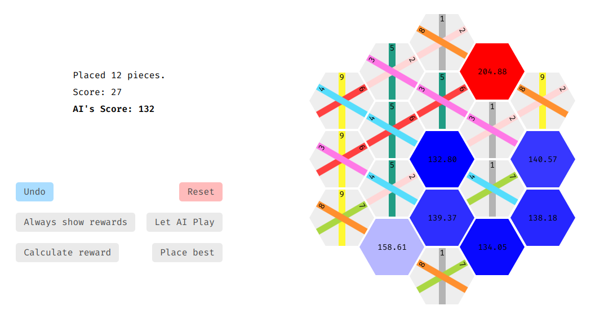

# Obtain It Lightly - The Game

*Obtain It Lighltly* is my online implementation of the popular game. It supports client-side inference and let's users play with the AI models I trained.

More information about the game and training under [obrhubr/take-it-easy](https://github.com/obrhubr/take-it-easy).

## Usage

Simply open the html file in your browser, or host it with your favourite static site hosting service (nginx, etc...).

Click "Load AI" to load the selected models.
Then either "Let AI Play" to have the model play the entire game, or click "Always show rewards" to show what the AI considers as good moves and press "Place Best" to automatically place the piece on that tile.

You can also opt to show the AI's calculations once, with "Calculate reward", which will allow you to avoid spoilers.

## Deploy own models

Install `pip3 install torch onnx`. Then run change the filenames in `models/convert.py` and run the script to convert your model from `torch` to the expected `onnx` format. Then change the HTML to load your own model and try it out.